# iOS

All my iOS apps developed by me so far. I just started this journey :)
In this repo you can find the complete XCode projects for each of those apps (and exercises).

###first app ever
This application is as simple as it can be:
- empty view with one "lame" button
- a second "great" view with a message and an image

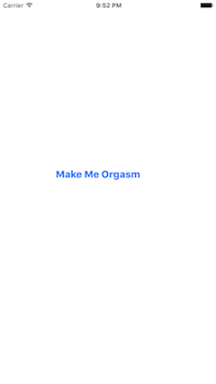

###Red and Blue
This is another simple and basic iphone app which starts with 2 images and 2 buttons.
Whenever a click on each button happens, the corresponding image disapears and the button's name will be changed.

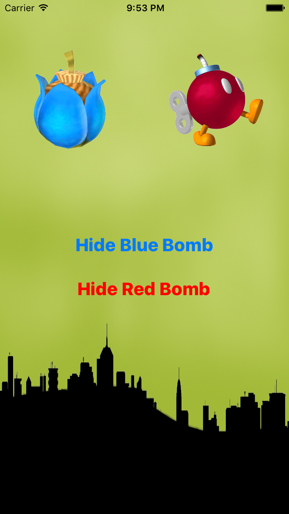

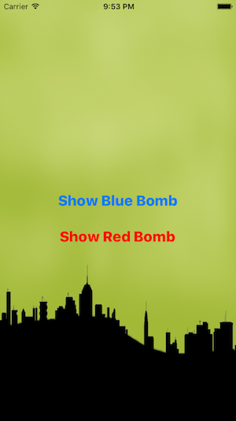
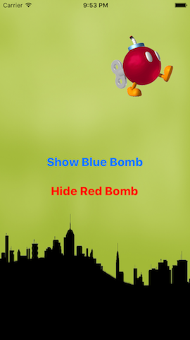

###auto layout
As I soon found out, it is very important in how one designs an app.
While it might look perfect on a specific device(e.g. iphone6), the same app on other devices might be a mess.
Here are the results of a very basic app which works great no matter the device:

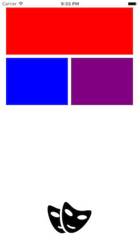
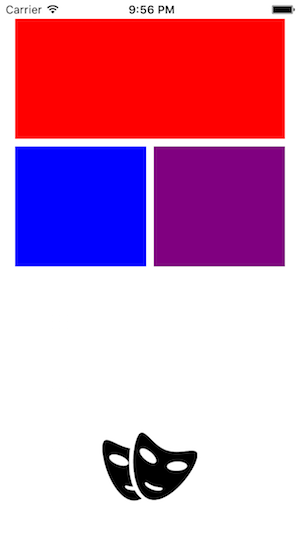
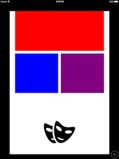

And here is another exercise I made that illustrated again those concepts:

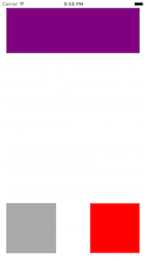
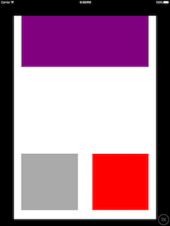

###Tap Tap
Tap Tap is a game in which a user has to... YES - TAP! 
The initial view starts with:
- the logo of the game (Tap Tap)
- a text field to introduce the number of taps a user wants to do
- a play button

When clicking the "play" button, the second view starts. It contains:
- the tap button
- a label that displays the taps number

If the taps number has reached the number inputed by the user, the game restarts.

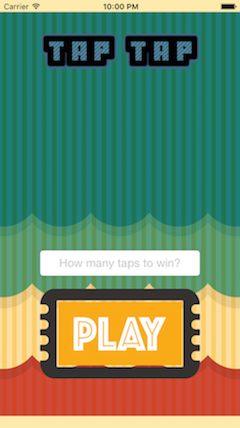
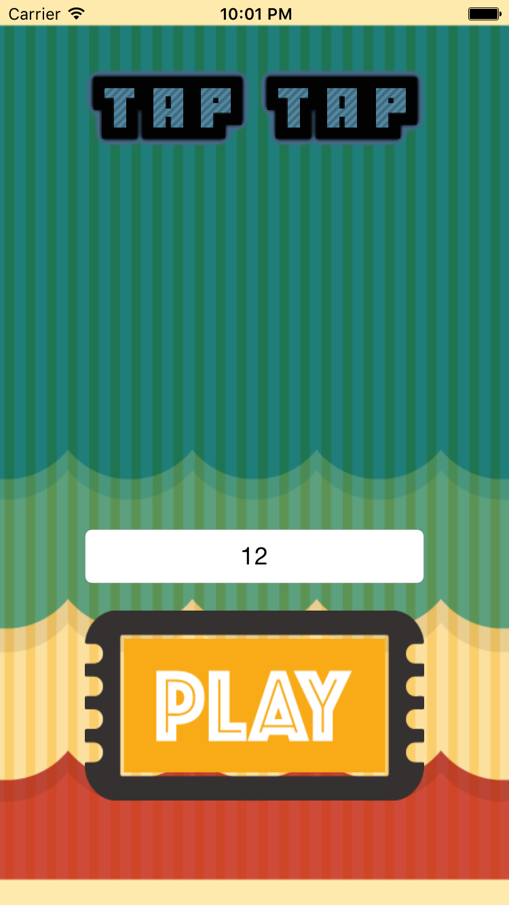
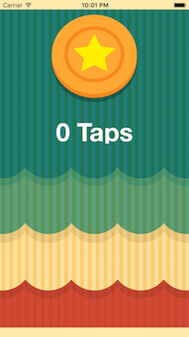
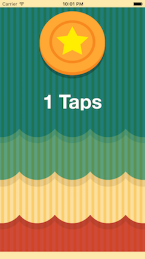
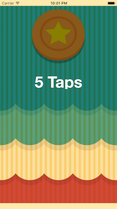
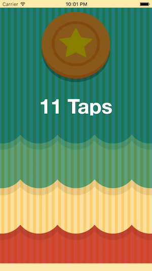

